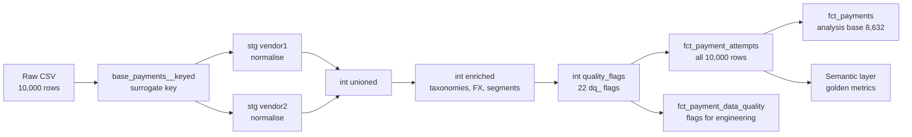

# Fan Payments Data Cleaning Log

As of 2026-09-19. Every figure is reproducible from the raw CSV with `dbt build` (see [Reproduce](#reproduce)).

## Summary

Cleaning turned a 10,000-row, two-gateway export with 22 documented defects into one reconciliation-grade table. No row is lost: every row keeps a stable key, and 8,632 eligible payments form the analysis base.

| Measure | Before (raw export) | After (clean layer) |
| --- | --- | --- |
| Rows | 10,000 | 10,000, none deleted |
| Unique row key | None: `psp_reference` has 9,942 distinct values | 10,000 unique `transaction_key` values |
| Rows in payment metrics | 10,000, all treated as payments | 8,632 eligible payments + 1,366 verification checks reported separately |
| Authorisation rate | 68.3% | 67.8% |
| Gateway 2 authorisation rate | 64.0% | 61.1% |
| Gateway 2 average amount | $23.76 | $31.46 (vs $32.09 on Gateway 1) |
| Attempted value | $279,237, mixing BRL and USD | $274,719, all USD |
| Decline reason vocabulary | 77 raw spellings | 35 standard reasons, 10 categories, 9 actions |
| Insufficient funds share of declines | 18.9% (largest single spelling) | 44.6% (all spellings combined) |
| Status conflicts | 47 apparent | 1 genuine |
| Suspected duplicate charges | 18 rows | 4 rows (2 excluded) |
| Initiator known (CIT/MIT) | 70.2% of rows | 99.9% of rows (inferred) |

The biggest single correction was separating the $0 card-verification checks. They were a quarter of Gateway 2's rows and made its payments look both cheaper and more successful than they are.

## Approach

Cleaning labels rows; it never deletes them. Finance needs the full attempt log to reconcile, so every defect becomes a flag, and analysis filters on those flags.



Each layer has one job:

| Layer | What cleaning happens there |
| --- | --- |
| Staging (one model per gateway) | Blanks to null, placeholder values nulled, gateway-specific field mix-ups corrected, both gateways mapped onto one set of columns |
| Intermediate: enriched | Seed-driven taxonomies (decline, AVS, issuer segment), FX conversion, name normalisation, CIT/MIT and revenue-stream segments |
| Intermediate: quality flags | One `dq_` flag per defect, plus `is_analysis_eligible` and `is_payment` |
| Marts | The fact table, the issue register (`agg_data_quality_summary`) and summary tables |
| Tests | 3 hard invariants that must never fail, 4 warn-level defect monitors, 24 schema tests |

Two filters define the analysis base. `is_payment` excludes $0 verification checks. `is_analysis_eligible` excludes duplicate approvals and genuine status conflicts. Every golden payment metric applies both.

## Profile before cleaning

The raw export is 10,000 rows × 38 columns: exactly 5,000 rows per gateway. Four columns are empty everywhere, seven exist on only one gateway, and several shared columns mean different things on each side.

| Column | G1 fill | G2 fill | What the raw values look like |
| --- | --- | --- | --- |
| `vendor` | 100% | 100% | vendor1 / vendor2 |
| `merchant_account` | 100% | 100% | 2 MIDs on G1, 5 on G2; barely overlap |
| `psp_reference` | 100% | 100% | Not unique: 9,942 distinct values across 10,000 rows |
| `scheme_reference` | 72.7% | 0% | 2,028 values in scientific notation (`7.64917E+14`) |
| `payment_account_reference` | 0% | 0% | Empty |
| `payment_method` | 100% | 100% | Visa / MasterCard (plus 1 `Invalid`) on G1; generic `CC` / `PIX` on G2 |
| `payment_method_variant` | 99.8% | 63.7% | Card product; `Visa Classic` vs `VISA CLASSIC` |
| `creation_date_ts` | 100% | 100% | `MM:SS.s` only; no date or hour on any row |
| `creation_date_time_zone` | 0% | 100% | UTC on G2 only |
| `currency` | 100% | 100% | USD; 87 BRL rows on G2 |
| `amount` | 100% | 100% | 1,366 rows at $0.00, all on G2 |
| `risk_scoring` | 0% | 0% | Empty |
| `transaction_type` | 40.7% | 99.8% | G1: blank / `MIT`. G2: `C` / `M`. Undocumented |
| `shopper_name` | 99.4% | 99.9% | Tokenised |
| `card_bin` | 100% | 100% | 4 invalid (`0`, `-1`, `000000`) |
| `card_last_4` | 100% | 100% | Fully masked on both (`****************` / `****`) |
| `shopper_ip` | 100% | 100% | On G2, 95% of rows share 3 IPs |
| `shopper_country` | 100% | 99.6% | 7 blank-space values on G2, one `N/A` on G1 |
| `issuer_name` | 99.8% | 73.4% | 1,217 spellings; case and punctuation vary |
| `issuer_bin` | 0% | 100% | Duplicates `card_bin` on G2 |
| `issuer_city` | 0% | 0% | Empty |
| `issuer_country` | 100% | 77.4% | n/a |
| `acquirer_response` | 100% | 100% | Approved / Declined / Failed |
| `authorisation_code` | 27.1% | 64.7% | G1: decline text, not codes. G2: real codes + 110 placeholders (`00000`, `000000`) |
| `raw_acquirer_response` | 27.1% | 36.1% | Decline reason; 77 spellings across gateways |
| `message_authentication_code` | 72.7% | 0% | Masked `******` on G1 approvals |
| `shopper_email` | 100% | 100% | Tokenised; the only Fan key on both gateways |
| `shopper_reference` | 100% | 0% | Fan ID on G1 only; `5` on 1,167 rows is a placeholder |
| `three_d_directory_response` | 100% | 8.6% | G1: Yes/No enrolment. G2: outcome text, sometimes raw errors |
| `three_d_authentication_response` | 14.8% | 0% | G1 only; initial vs subsequent MIT |
| `cvc2_response` | 0.4% | 15.6% | Two vocabularies, 7 codes |
| `avs_response` | 99.2% | 81.6% | Prose on G1, single letters on G2: 21 codes |
| `billing_street` | 99.5% | 100% | Tokenised |
| `billing_house_number_name` | 0% | 0% | Empty |
| `billing_city` | 99.5% | 100% | Plain text |
| `billing_postal_code_zip` | 99.4% | 99.2% | Tokenised |
| `billing_state_province` | 0% | 70.5% | G2 only |
| `billing_country` | 100% | 99.8% | n/a |

Two of these defects share one cause: the file passed through a spreadsheet. Display formatting removed the timestamps' dates and truncated the network transaction IDs.

## Every cleaning step

26 steps in three kinds: 11 corrections that change or null a value, 11 standardisations and derived fields, and 4 exclusions from the analysis base. The raw value is kept alongside wherever a value is corrected.

### Corrections: values changed or nulled

| # | Issue in the raw data | Rule applied | Rows | Where |
| --- | --- | --- | --- | --- |
| 1 | `psp_reference` reused across different Fans (55 values) | New `transaction_key`: hash of the row's business fields + occurrence index | 10,000 | [`base_payments__keyed`](../models/staging/base/base_payments__keyed.sql) |
| 2 | Empty strings and stray spaces | Trimmed; blank becomes null | All columns | [`blank_to_null`](../macros/normalisation.sql) macro, staging |
| 3 | Timestamps are `MM:SS` fragments | Raw kept as `creation_clock_raw`; `created_at` left null; `has_resolvable_timestamp` = false | 10,000 | staging |
| 4 | No timezone on Gateway 1 | Set to `UNSPECIFIED` rather than assuming UTC | 5,000 | [`stg_payments__vendor1`](../models/staging/stg_payments__vendor1.sql) |
| 5 | Gateway 1 writes decline text into `authorisation_code` | Auth code nulled; the text moved to `decline_reason_raw` | 1,354 | [`stg_payments__vendor1`](../models/staging/stg_payments__vendor1.sql) |
| 6 | Gateway 2 placeholder auth codes `00000` / `000000` | Nulled and flagged | 110 | [`stg_payments__vendor2`](../models/staging/stg_payments__vendor2.sql) |
| 7 | Gateway 1 `shopper_reference = 5` for unrelated Fans | Nulled and flagged | 1,167 | [`stg_payments__vendor1`](../models/staging/stg_payments__vendor1.sql) |
| 8 | Country `N/A` and blank-space values | Nulled | 8 | staging |
| 9 | Invalid card BINs (`0`, `-1`, `000000`) | Nulled and flagged | 4 | staging |
| 10 | BRL amounts summed as if dollars | Converted to `amount_usd` at a proxy 5.50 BRL per USD | 87 | [`int_payments__enriched`](../models/intermediate/int_payments__enriched.sql) |
| 11 | Card product casing differs by gateway | Upper-cased into `card_product_std`: 94 raw values become 84 | 8,180 with a product | [`int_payments__enriched`](../models/intermediate/int_payments__enriched.sql) |

### Standardisation and derived fields

| # | Problem | Rule applied | Result | Where |
| --- | --- | --- | --- | --- |
| 12 | 77 decline spellings across two gateways | Seed mapping to reason, category, retryable flag and business action | 35 reasons, 10 categories, 9 actions | [`seeds/decline_reason_map.csv`](../seeds/decline_reason_map.csv) |
| 13 | Address check in two vocabularies (prose vs letters) | Seed mapping to standard code and outcome | 21 codes become 5 outcomes | [`seeds/avs_response_map.csv`](../seeds/avs_response_map.csv) |
| 14 | Issuer names split by case and punctuation | Upper-case, punctuation to spaces: `issuer_name_std` | 1,217 names become 1,074 | [`int_payments__enriched`](../models/intermediate/int_payments__enriched.sql) |
| 15 | Gateway 2 sends generic `CC` as payment method | Scheme taken from method or product: Visa, Mastercard, PIX, Unknown | 1,982 stay Unknown | [`normalise_card_scheme`](../macros/normalisation.sql) macro |
| 16 | Initiator in two undocumented taxonomies | G1 blank = CIT, G1 `MIT` = MIT; G2 `C` = CIT, `M` = MIT | 99.9% of rows assigned (was 70.2%) | [`int_payments__enriched`](../models/intermediate/int_payments__enriched.sql) |
| 17 | Gateway 1 MIT mixes first charges and rebills | `mit_stage`: initial (3DS "Initial MIT"), subsequent rebill (placeholder `5`), other | 2,034 G1 MIT rows split | [`int_payments__enriched`](../models/intermediate/int_payments__enriched.sql) |
| 18 | 3DS column means enrolment on G1, outcome on G2 | One `three_ds_status` per gateway's meaning | 5 statuses | [`int_payments__enriched`](../models/intermediate/int_payments__enriched.sql) |
| 19 | No issuer type in the data | Fintech sponsor banks tagged from outside knowledge | 8 issuers | [`seeds/issuer_segment_map.csv`](../seeds/issuer_segment_map.csv) |
| 20 | No region, corridor or amount grouping | `region`, `geo_corridor` (issuer vs Fan country), `amount_band` | All rows | [`int_payments__enriched`](../models/intermediate/int_payments__enriched.sql) |
| 21 | No revenue view of a payment | `revenue_stream`, `creator_share_usd` (80% of approved value) | All rows | [`int_payments__enriched`](../models/intermediate/int_payments__enriched.sql) |
| 22 | No usable date for reporting | `reporting_date` stamped 2026-07-01 from the brief | 10,000 | [`int_payments__enriched`](../models/intermediate/int_payments__enriched.sql) |

### Exclusions from the analysis base (flagged, never deleted)

| # | Issue | Rule | Rows | Flag |
| --- | --- | --- | --- | --- |
| 23 | $0 card-verification checks mixed in with payments | `transaction_purpose` = card_verification; out of payment metrics | 1,366 | `is_payment` = false |
| 24 | The same Fan, BIN, amount and gateway approved more than once | Flag every approval in the group; exclude all but the first | 4 flagged, 2 excluded | `dq_duplicate_charge_extra` |
| 25 | Declined with a real auth code, or approved with a decline reason | Excluded, after placeholders were removed in step 6 | 1 | `dq_status_reason_conflict` |
| 26 | Byte-identical repeated rows | Excluded if present | 0 found | `dq_exact_duplicate_row` |

The remaining defects can't be corrected downstream, only flagged: missing dates, the non-unique reference, missing Fan IDs, masked card digits, shared server IPs, truncated network IDs and permanently empty columns. They sit in the issue register for the gateways to fix at source.

## Profile after cleaning

`fct_payment_attempts` keeps all 10,000 rows, now with 63 columns: every raw field and its cleaned version. The 22 quality flags sit beside it in `fct_payment_data_quality`, joined on `transaction_key`, so the analyst-facing table stays readable. Every row has a unique key, a USD amount, a revenue stream and an initiator.

### Analysis base

| Stage | Rows |
| --- | --- |
| Rows in the export | 10,000 |
| Less $0 card-verification checks | −1,366 |
| Less duplicate approvals (extra copies) | −2 |
| Less genuine status conflicts | −0 among payments (the 1 conflict is a verification check) |
| **Eligible payments** | **8,632** |

### Key fields after cleaning

| Field | All rows | G1 | G2 | Distinct values | Note |
| --- | --- | --- | --- | --- | --- |
| `transaction_key` | 100% | 100% | 100% | 10,000 | Unique; replaces `psp_reference` as the key |
| `amount_usd` | 100% | 100% | 100% | 2,345 | BRL converted at the proxy rate |
| `revenue_stream` | 100% | 100% | 100% | 6 | Fan-present purchase, subscription start, renewal, other MIT, card verification, unknown |
| `initiator_inferred` | 99.9% known | 100% | 99.8% | CIT 6,809 · MIT 3,181 | 10 rows unknown |
| `card_scheme` | 100% | 100% | 100% | 4 | 1,982 rows (19.8%) still Unknown |
| `card_product_std` | 81.8% | 99.8% | 63.7% | 84 | Missing where G2 sent no product |
| `issuer_name_std` | 86.6% | 99.8% | 73.4% | 1,074 | Was 1,217 spellings |
| `issuer_segment` | 100% | 100% | 100% | 3 | Mainstream, fintech sponsor bank, unknown |
| `avs_outcome` | 90.4% | 99.2% | 81.6% | 5 | One vocabulary across both gateways |
| `three_ds_status` | 100% | 100% | 100% | 5 | Each gateway's meaning kept |
| `decline_reason_std` | 3,153 of 3,167 declines | n/a | n/a | 35 | 14 declines arrived with no reason |
| `business_action` | Same as reason | n/a | n/a | 9 | E.g. retry at a better time, stop and treat as cancellation |
| `authorisation_code` | 97.7% of G2 approvals | 0% | 62.5% | 3,121 | G1 never supplies one; placeholders removed |
| `fan_reference` | 38.3% | 76.7% | 0% | 3,833 | Was 50%; placeholder `5` removed. `fan_email_token` (100%) is the usable Fan key |
| `scheme_reference` | 36.3% | 72.7% | 0% | 1,999 | 2,028 values truncated; flagged, can't be repaired |
| `created_at` | 0% | 0% | 0% | n/a | Stays empty until the export carries real timestamps |

The average row carries 3.3 quality flags and the worst carries 8. Most flags mark gaps, such as missing dates or masked card digits, not errors that change a number.

## Before vs after: what moved the numbers

Three steps change the headline figures: separating the $0 checks, removing duplicate approvals, and converting BRL. The $0 checks account for almost all of the movement in authorisation rate.

| Step | Rows counted | Authorisation rate | Gateway 2 rate | Attempted value | Declined value |
| --- | --- | --- | --- | --- | --- |
| Raw export | 10,000 | 68.33% | 63.98% | $279,237 (mixed currency) | $86,797 |
| Separate $0 verification checks | 8,634 | 67.82% | 61.14% | $279,237 | $86,797 |
| Remove duplicate-approval extras | 8,632 | 67.82% | 61.14% | $279,210 | $86,797 |
| Convert 87 BRL rows to USD | 8,632 | 67.82% | 61.14% | $274,719 | $84,217 |

Other shifts that change the story, not just the totals:

| What | Before | After | Why it matters |
| --- | --- | --- | --- |
| Gateway gap, all payments | 8.7 points | 11.5 points | The $0 checks flattered Gateway 2 |
| Gateway 2 average payment | $23.76 | $31.46 | The gateways charge about the same per payment; the earlier gap was the $0 rows |
| Insufficient funds share of declines | 18.9% | 44.6% | The largest recovery lever, previously split across three spellings |
| Apparent status conflicts | 47 | 1 | 46 were Gateway 2's placeholder auth codes, not real incidents |
| Suspected duplicate charges | 18 rows | 4 rows | Declines followed by retries are normal behaviour, not double charges |
| Rows with a usable Fan ID | 50.0% | 38.3% | The `5` placeholder looked like an ID; `fan_email_token` is the real key |
| Initiator (CIT/MIT) known | 70.2% | 99.9% | Makes the rebill vs Fan-present split possible, the #1 driver of approval |

## Assumptions and open questions

Five cleaning rules rest on assumptions rather than facts in the file. Each is a single variable or seed row, so it can be changed in one place.

| Assumption | Where it lives | Evidence | Question for the source |
| --- | --- | --- | --- |
| BRL converted at 5.50 per USD | `fx_brl_per_usd` var | None: proxy rate, 87 rows only | Which rate does Finance use for July 2026? |
| G2 `C` = customer-initiated, `M` = merchant-initiated | `int_payments__enriched` | `C` matches G1 CIT on price and approval; `M` matches G1 rebills; 3DS only on CIT rows | Can Gateway 2 confirm its `transaction_type` codes? |
| G1 `shopper_reference = 5` marks rebills | `stg_payments__vendor1` | All 1,167 are MIT, about $19.70 average, about 32% approval | What does Gateway 1 put in this field for rebills? |
| $0 rows are card-verification checks | `int_payments__enriched` | All on G2, 1,365 of 1,366 type `C`, 71.6% pass rate | Does Gateway 2 flag zero-value auths anywhere? |
| 8 issuers are fintech sponsor banks | `seeds/issuer_segment_map.csv` | Outside knowledge only; card products mostly say `VISA CLASSIC` | Can the BIN provider supply a funding type (debit, credit, prepaid)? |

One rule is deliberately not applied: debit, credit or prepaid is not derived from the card product name, because 36% of Gateway 2 rows have no product.

## Reproduce

Every number in this doc comes from the raw CSV and the dbt models in the repo.

```bash
source .venv/bin/activate
export DBT_PROFILES_DIR=.
dbt build          # expect PASS=42 WARN=4 ERROR=0
duckdb casestudy.duckdb
```

| To check | Query |
| --- | --- |
| The full issue register | `select * from main_marts.agg_data_quality_summary` |
| Any row's flags | `select * from main_marts.fct_payment_data_quality where transaction_key = '...'` |
| The analysis base | `... where is_payment and is_analysis_eligible` (8,632 rows) |
| The mapping tables | [`decline_reason_map.csv`](../seeds/decline_reason_map.csv), [`avs_response_map.csv`](../seeds/avs_response_map.csv), [`issuer_segment_map.csv`](../seeds/issuer_segment_map.csv) |
| Assumed values | `vars:` in [`dbt_project.yml`](../dbt_project.yml) |

The four warnings are the known defects (missing timestamps, reference collisions, one status conflict, duplicate approvals), kept at warn level so they stay visible. A new failure means the source data changed.
